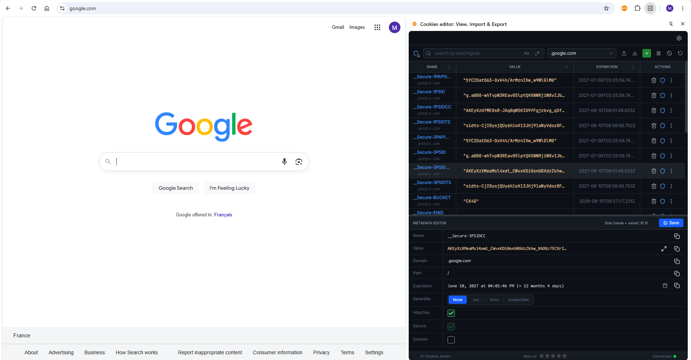
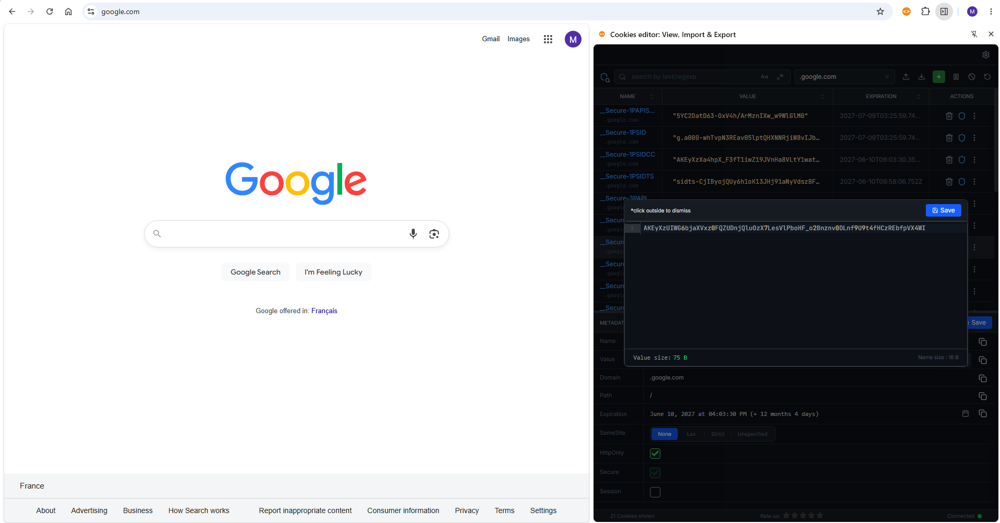

# Cookies Editor: View, Import & Export Cookies 🍪

A lightweight, powerful, and privacy-focused browser extension that allows you to view, edit, import, and export cookies directly from your browser. Perfect for developers, QA engineers, and privacy-conscious users.

---

## ✨ Features

* **🔍 View & Search:** Easily browse all cookies for the current tab or search for specific cookies by name or domain.
* **✍️ Live Editing:** Create, modify, or delete any cookie value, expiration date, path, or secure flags on the fly.
* **📥 Import Cookies:** Seamlessly import cookies from JSON format to quickly set up sessions or test environments.
* **📤 Export Cookies:** Export your current cookies to JSON with a single click—ideal for backups, automation scripts, or sharing sessions.
* **🔒 Privacy First:** No external analytics, no cloud storage, and no data tracking. Your cookie data stays strictly on your machine.

---

## 📸 Screenshots

> *Tip: You can add your extension screenshots here by uploading them to an `images` folder in this repository.*

  
  

---

## 🚀 How to Use

1. Install the extension from the [Chrome Web Store](https://chromewebstore.google.com/detail/cookies-editor-view-impor/jadkflddmcbaakhjablcealajecbkbom).
2. Click the **Puzzle piece icon** (Extensions menu) in the top-right corner of Chrome.
3. Find **Cookies Editor** and click the **Pin** 📌 icon to keep it visible on your toolbar.
4. Click the extension icon on any website to manage its cookies instantly!

---

## 🛡️ Privacy & Security

We take security seriously, especially when handling sensitive browser data like session cookies:
* The extension requires host permissions only to read and write cookies for the sites you actively interact with.
* **Zero data collection:** We do not track your browsing history, usage statistics, or personal information. Everything runs locally in your browser.

---

## 💬 Feedback & Support

Since this repository contains documentation and assets only, the source code is kept private. However, we love feedback! 

If you encounter a bug, have questions, or want to suggest a feature:
* Open a new issue in the [Issues](../../issues) tab of this repository.
* Rate or leave a review on the [Chrome Web Store](https://chromewebstore.google.com/detail/cookies-editor-view-impor/jadkflddmcbaakhjablcealajecbkbom).

---

Made with ❤️ for developers and power users.

